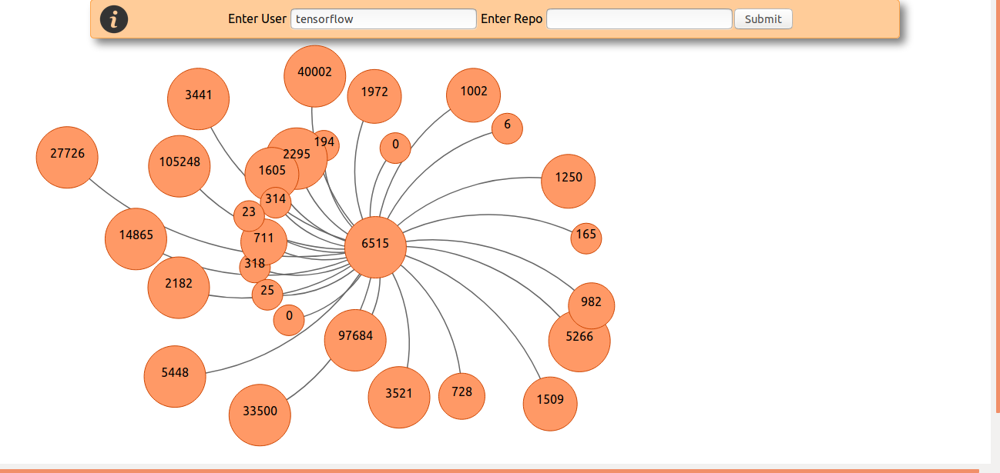
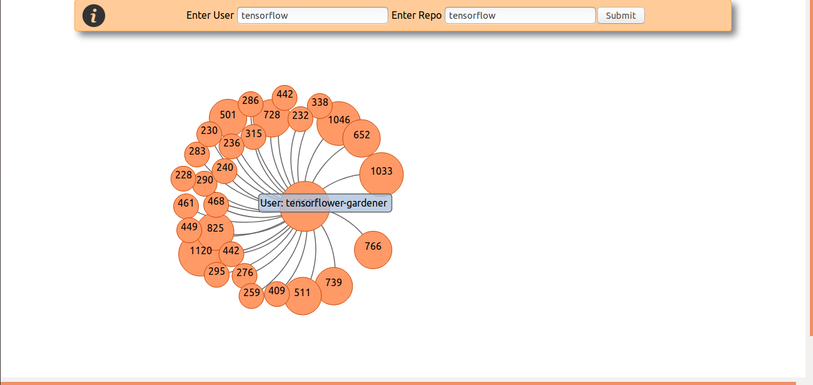
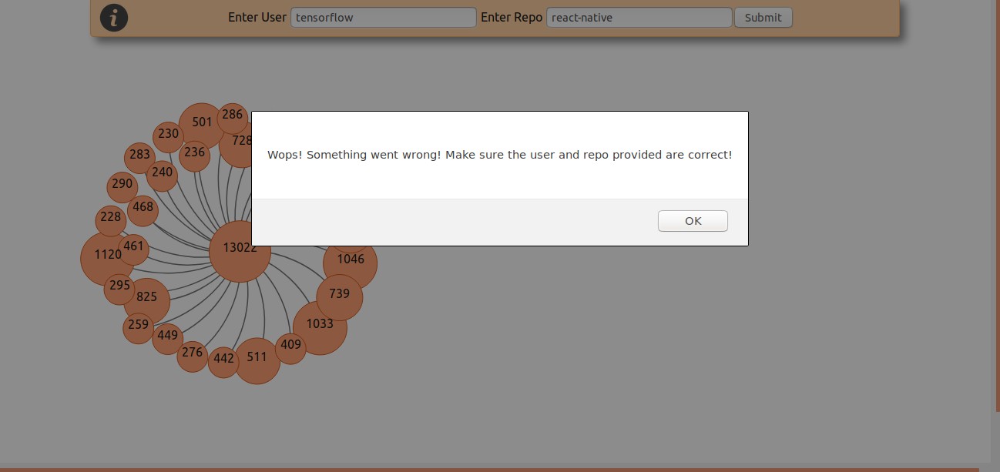
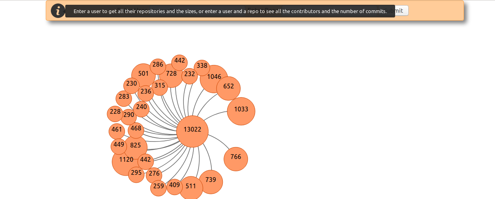

# Github Data Visualizatione
This project is part of CS3012 Coursework, Trinity College Dublin.  
The aim is to interrogate the Github API and fetch data that could be useful in elucidating aspects of the software engineering process. The course requires the data to be used in some sort of visualization. The project I put together collects data regarding repos, commits and contributors and shows it in a Force Directed Graph. The size of the nodes scales depending on the number of commits. This way, my application makes it easy to view the users with the most impact on a project. (The number of contributors shown is capped at 30).

## Technologies used
1. React
2. D3
3. Node.js
4. NPM

### [React](https://reactjs.org/)
React is a declarative, component-based JavaScript library used for building interfaces.
I used React both for the frontend and fetching the data, with the built-in fetch command.

### [D3](https://d3js.org/)
D3 is another JavaScript library. It's used to build interactive, dynamic web visualization.
I used this library to create a Force-Directed Graph.
**Important** I had to downgrade to a version 3 of D3 because of some backwards compatibilty with one of the methods used for creating the Force-Directed Graph.

### [Node.js](https://nodejs.org/en/)
Node.js is an open-source, cross-platform JavaScript run-time environment that executes JavaScript code outside of a browser.
I used Node.js for the GithubAccess part of the assignment. I started using it in order to fetch the data. I was planning to save this data in MongoDb, but eventually I realized having a database didn't make much sense for my project. I can also simply fetch data in React, so I decided to give up on Node.js. Not to mention that using Node.js and React would've required me to learn several other technologies (like Express), and I am already new to React and D3.

### [NPM](https://www.npmjs.com/)
npm is a package manager for the JavaScript programming language. I used this on Linux to download all the required packages and to start the React application.

## Project
My project consists of a Force-Directed Graph. In order to populate this graph with data, there are two options.  
1. **Query for user repositories**  
If the user field in the form at the top is the only one supplied, then the Graph will show the repositories available for the given user. The number in the nodes represents the size of a repo. If you hover over a node, you can see the name of the repo.  

2. **Query for contributors & number of commits.**  
If both the user and the repo field are supplied, then the Graph will show a visualization of the contributors and their respective number of commits. The nodes resize depending on the number of commits they represent. Again, if you hover over a node, you can see the name of the user who contributed.  

**Error Checking**  
If the fetch instructon fails, for various reasons, (could be that the API limit has been achieved, or that the supplied repo doesn't belong to a certain user) a message will be displayed that hints at the possible error.  

**Help**  
In case the interface is confusing, which I hope is not. There is a help button that explains the functionality of the app.  

## Install
Setting up the project locally requires npm to be installed on the machine. All the dependecies of the project are listed in /visual/package.json. Thus, simply clone the Github repo, then perform  
 
**npm install**  
 

Then   
 
**npm start**  
 
Which runs the app in the development mode. 
Open [http://localhost:3000](http://localhost:3000) to view it in the browser.
